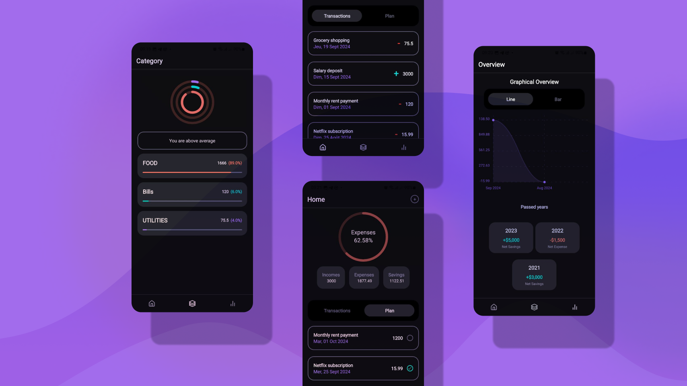

# Kolandéla

Kolandéla is an application for managing and planning expenses.

The name Kolandéla comes from the Lingala word which means tracking.

The idea came from a personal need to track my expenses.
I think it is important to know how to evaluate in order to improve ;
and to evaluate, we need to have the necessary data.




## Installation

The project use pnpm as package manager but the others one should work.
You can install it by running the following command:

```bash
git clone https://github.com/ssnnee/kolandela.git
cd kolandela
pnpm install
```

## Usage

To start the application, you need to start the json server and the expo server.
Please make sure to add your own ip address in the `api/transactions.ts` file.

```bash
pn dlx json-server  db.json
pnpm start
```

The json-server will start on port 3000. And you can speicfy the port with the `--port` option.

```bash
pn dlx json-server  db.json --port 3001
```

Once the expo server is started, you can run the application on your device or on the web.

## Features

- Add expenses
- Add income
- Add categories
- Plan expenses
- Plan income
- View expenses
- View income
- View categories
- View statistics

## Technologies and Librairies

- [React Native](https://reactnative.dev/)
- [Expo](https://expo.dev/)
- [React Native Chart Kit](https://github.com/indiespirit/react-native-chart-kit)
- [React Native Raw bottom Sheet](https://github.com/nysamnang/react-native-raw-bottom-sheet)
- [React Hook form](https://react-hook-form.com/)
- [Zod](https://zod.dev/)
- [Reac Native Calendars](https://github.com/wix/react-native-calendars)
- [JSON server](https://github.com/typicode/json-server)


## Contributing

Pull requests are welcome. For major changes, please open an issue first
to discuss what you would like to change.

## Backend
For now the application use a json file as a database.
But I plan to write a Go backend [here](https://github.com/Ssnnee/kolandela_backend).

## Next Steps

- [ ] Write the Go backend
- [ ] Use react-query for data fetching everywhere
- [ ] Add a search features
- [ ] Add authentication or simply provide a way to back up data (such as a QR code, csv export etc.)
- [ ] Add settings (such as light theme, currency, language)

